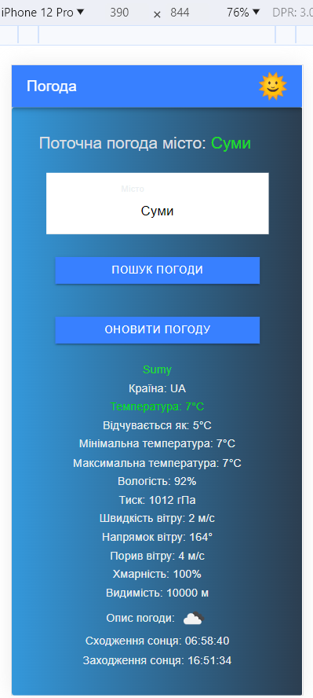

## I used :

- HTML
- CSS
- ANGULAR-IONIC
- ADAPTIVE

###You should register on the OpenWeather website, obtain an API key, and insert it into the weather.service file in the empty string private apiKey = ' '

